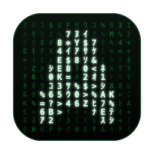

# Ametrix

<p align="center">
  
</p>

A native macOS Matrix-style digital rain screen saver and live wallpaper.

Ametrix installs as a real macOS `.saver` bundle and includes a live desktop
wallpaper. The renderer is native AppKit/CoreText code: no terminal emulator,
PTY, shell animation process, or external Matrix-rain dependency is required.

macOS still handles the actual authentication layer: password, Touch ID, Apple
Watch unlock, and screen-saver password policy.

## Features

- Native macOS screen saver bundle
- `Control-Command-Z` lock shortcut to override the macOS native version
- Optional live wallpaper mode
- Multi-display support
- Configurable color presets, density, speed, trails, font, and glyph palette
- No network access or telemetry

## Requirements

- macOS 13 or newer
- Swift 5.9 or newer and Xcode when building from source

## Quick Start

### Option 1
Download `Ametrix.dmg` from the latest GitHub release, open it, and drag
`Ametrix.app` into Applications.

### Option 2
Clone this repository and build the Universal 2 app from source:

```bash
scripts/release/package-app.sh
```

This creates `dist/Ametrix.app`. Launch it directly:

```bash
open dist/Ametrix.app
```

The onboarding guide installs the screen saver and opens the relevant System
Settings page. After setup, use the menu bar icon to control the wallpaper, open
preferences, or quit Ametrix.

## Configuration

Edit the canonical TOML config:

```bash
~/Library/Application Support/Ametrix/config.toml
```

Example:

```toml
frameRate = 60
preset = "classic"
density = 1.0

fontName = "Menlo"
fontSize = 16

# Explicit colors override preset colors.
# backgroundColor = "#000000"
# headColor = "#d9ffd9"
# tailColor = "#00ff41"

minimumTailAlpha = 0.08
characters = "0123456789ABCDEFGHIJKLMNOPQRSTUVWXYZabcdefghijklmnopqrstuvwxyzアイウエオカキクケコサシスセソタチツテトナニヌネノハヒフヘホマミムメモヤユヨラリルレロワヲン@#$%&*+-=<>"

[speed]
min = 18
max = 38

[trail]
min = 14
max = 48
rowMultiplier = 0.75
```

Supported fields:

| Field | Purpose |
|---|---|
| `frameRate` | Animation frame rate, 15-120 |
| `preset` | Color preset: `classic`, `amber`, `cyan`, `white`, `violet` |
| `density` | Rain-column density, 0.2-3.0 |
| `fontName` / `fontSize` | Glyph font |
| `backgroundColor` | Hex background color |
| `headColor` | Hex rain-head color |
| `tailColor` | Hex trail color |
| `minimumTailAlpha` | Faintest tail opacity |
| `speed.min` / `speed.max` | Falling speed range |
| `trail.min` / `trail.max` | Trail length range |
| `trail.rowMultiplier` | Trail cap relative to screen rows |
| `characters` | Glyph palette |

Preset colors are applied first. Explicit color fields override preset colors.

`~/.config/ametrix/config.toml` is still read as a fallback for older installs. The older `config.json` format is only used when no TOML config exists.

## Screen Saver Container

Modern macOS runs `.saver` bundles inside:

```bash
~/Library/Containers/com.apple.ScreenSaver.Engine.legacyScreenSaver/Data
```

That container has its own home directory, so a screen saver process cannot
reliably read the normal user config path. Ametrix syncs the canonical TOML
config into the container before starting the screen saver.

## Development

Script layout:

```text
scripts/
  branding/                 Reproducible app icon renderer
  dev/                      Local development and testing helpers
  release/                  Screen saver build, app packaging, signing, notarization
```

Clean-slate test as a first-time user (resets prefs, installed saver, and config,
then repackages and relaunches so the onboarding guide appears):

```bash
scripts/dev/retest.sh             # full reset, repackage, launch
scripts/dev/retest.sh --keep      # keep installed saver + config, only reset prefs
scripts/dev/retest.sh --no-build  # skip repackaging, reuse dist/Ametrix.app
```

Build a local `.app` bundle:

```bash
scripts/release/package-app.sh
```

Build, sign, notarize, and package a release DMG:

```bash
scripts/release/sign-notarize-dmg.sh
```

The script automatically uses the only installed Developer ID Application
certificate and the `ametrix-notary` Keychain profile. Create that profile once:

```bash
xcrun notarytool store-credentials ametrix-notary
```

Follow the prompts to use an App Store Connect API key or Apple ID credentials.
The resulting profile is stored in the macOS Keychain, not in this repository.

For a signed-only local DMG without notarization:

```bash
AMETRIX_SKIP_NOTARIZE=1 \
scripts/release/sign-notarize-dmg.sh
```

Build only the screen saver bundle:

```bash
scripts/release/build-screensaver.sh
```

Useful environment variables:

| Variable | Purpose |
|---|---|
| `AMETRIX_SAVER_DEST_DIR` | Override `.saver` build output directory |
| `AMETRIX_SIGN_IDENTITY` | Override the auto-detected Developer ID Application identity |
| `AMETRIX_NOTARY_PROFILE` | Override the default `ametrix-notary` Keychain profile |
| `AMETRIX_SKIP_NOTARIZE=1` | Build a signed local DMG without Apple notarization |
| `DEVELOPER_DIR` | Select a specific Xcode toolchain; otherwise `/Applications/Xcode.app` is used when present |

## Architecture

```text
Sources/ametrix/main.swift
  App lifecycle, menu bar controller, wallpaper, and screen saver launch

Sources/ametrix/AmetrixConfiguration.swift
  TOML/JSON config loading, presets, screen saver container paths

Sources/ametrix/MatrixRainView.swift
  Native CoreText renderer

Sources/AmetrixScreenSaver/AmetrixScreenSaverView.swift
  ScreenSaverView wrapper around MatrixRainView
```

## Privacy

Ametrix does not collect telemetry, call network services, or shell out to
third-party animation tools. It reads local configuration files and installs its
bundled screen saver during onboarding.

## License

MIT. See [LICENSE](LICENSE).
